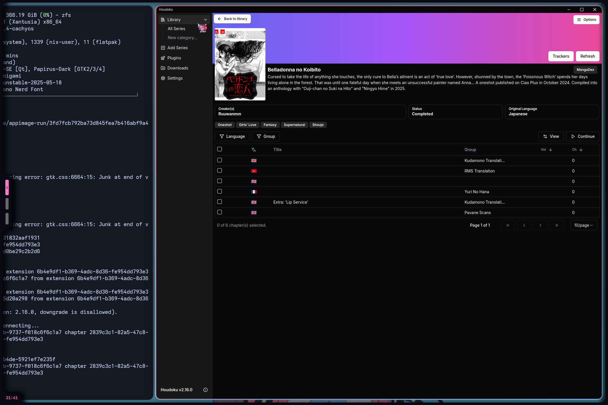

# 🚀 My Nix Packages For Themeing(Mono Repo)

Welcome to my personal **Nix flake mono repository**!  
This repo contains multiple custom Nix packages & derivations that I maintain and use across my systems.

## ⚠️ Disclaimer about `hyprscroller`

> **Important:**  
> The `Houdoku` package in this repo directly download from houdoku official v2.16.0 **Why i do not use the fetchfromgithub with their source repo, i want to add the application icon for my derivation**.  
> I make this repo and packages is for my personal use and there is anywhere i cant find this packages.if you want to support plz go and give the original creator. i am just the stealer for my needs:  
> [https://github.com/xgi/houdoku](https://github.com/xgi/houdoku)


> **Important:**  
> The `hyprscroller` package in this repo currently **does not work properly**.  
> Please use the original maintained version here instead:  
> [https://github.com/cpiber/hyprscroller](https://github.com/cpiber/hyprscroller)

---

## 🔧 Included Packages

| Package                   | Description                                          | Status                                            | Repo / Docs                                        |
|---------------------------|------------------------------------------------------|---------------------------------------------------|---------------------------------------------------|
| 🎨 **catppuccin-icons**        | Beautiful Catppuccin icon theme                       |  | [GitHub](https://github.com/maotseantonio/catppuccin-icons)       |
| 🖱️ **kureiji-ollie-cursors**  | Custom Kureiji Ollie cursor theme                     |  | [GitHub](https://github.com/maotseantonio/Kureiji-Ollie-Cursors)  |
| 💻 **hyprscroller**            | Hyprland layout plugin — smooth scrolling layouts     |          | [GitHub](https://github.com/maotseantonio/hyprscroller)           |
| 🎨 **cat-plymouth**            | Catppuccin Plymouth Theme —  Modify Version     |          | [GitHub](https://github.com/maotseantonio/cat-plymouth)           |
 🔥 **sddm-stray**              | SDDM tray and theme helper                           |           | [GitHub](https://github.com/maotseantonio/sddm-stray-flakes)      |
| 💻 **Houdoku**            | Houdoku Manga Reader —  Appimage Version        |          | [GitHub](https://github.com/maotseantonio/hyprscroller)           |
| 📟 **rxfetch**                 | Fast, minimal system fetch with style                |          | [GitHub](https://github.com/mngshm/rxfetch.git)                |
| 🌿 **nitch**                   | Minimal Nix-based system information fetch tool      |  | [GitHub](https://github.com/ssleert/nitch.git)                  |

---
## 🖼️ Showcase (Rice Photos)

### Catppuccin Icons  


### Kureiji Ollie Cursors  


### sddm-stray-theme  


### nitch 


### rxfetch


### cat-plymouth


### Houdoku(Appimage Version)


---

## 📦 Usage

Add this mono repo as a flake input to your own `flake.nix` and packages as `config.nix`:

```nix
inputs.shizuruPkgs.url = "github:maotseantonio/shizuruPkgs";

{
  environment.systemPackages = with pkgs; [
    inputs.shizuruPkgs.packages.${pkgs.system}.catppuccin-icons
    inputs.shizuruPkgs.packages.${pkgs.system}.kureiji-ollie-cursors
    inputs.shizuruPkgs.packages.${pkgs.system}.sddm-stray
  ];
}
```
---

## 🎖️ Credits

Thanks to these amazing projects and contributors for inspiration and code. The kofi link is not mine for the original creator:

- **Houdoku(Manga Reader)** by [xgi](https://github.com/xgi/houdoku)  
- **Catppuccin Icons** by [ljmill](https://github.com/ljmill/catppuccin-icons)  
- **sddm-stray** by [Bqrry4](https://github.com/Bqrry4/sddm-stray)  
- **Kureiji Ollie Cursor** supported via [Ko-fi](https://ko-fi.com/s/0f16e071d4)  
